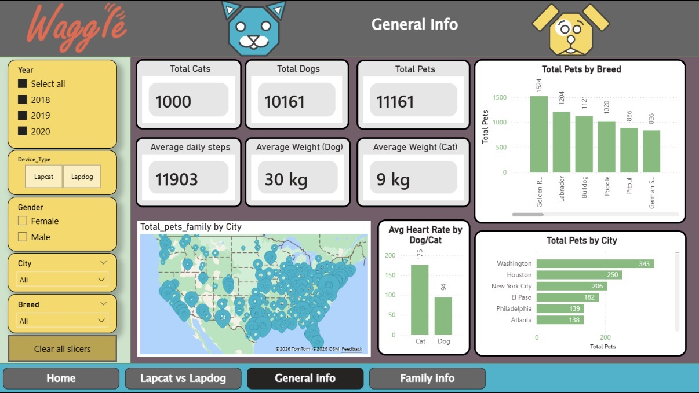

<div align="center">


<br/>

[](https://app.powerbi.com/view?r=eyJrIjoiNjFlM2IxMDEtODU4Zi00ZTcwLWE5YWItNDkwNmUyMzBlOWJmIiwidCI6IjNlMTE2YjM1LWRkMjgtNDY2ZS1hZjdhLWFlZjZkZDMwYzY0MCIsImMiOjl9&pageName=0a3ea1486f61ad002ed5)


</div>

-----

## 📌 Project Overview

This project presents a comprehensive **Power BI dashboard** built for **Waggle**, a US-based pet-tech startup. The analysis evaluates the performance of Waggle’s flagship wearable tracker **Lapdog** and the pilot-phase product **Lapcat**, using real pet activity, demographic, and household data collected across the United States.

> *“Can Waggle successfully expand from dogs to cats? The data tells a clear story.”*

-----

## 🔗 Live Interactive Dashboard

[](https://app.powerbi.com/view?r=eyJrIjoiNjFlM2IxMDEtODU4Zi00ZTcwLWE5YWItNDkwNmUyMzBlOWJmIiwidCI6IjNlMTE2YjM1LWRkMjgtNDY2ZS1hZjdhLWFlZjZkZDMwYzY0MCIsImMiOjl9&pageName=0a3ea1486f61ad002ed5)

-----

## 📊 Dashboard Preview



> **General Info page** — KPI cards, US geographic distribution, breed breakdown, heart rate comparison, and city-level totals. Fully interactive with slicers for Year, Device Type, Gender, City, and Breed.

-----

## 🚀 Key Insights & Strategic Findings

| |Finding               |Detail                                                                  |
|-|----------------------|------------------------------------------------------------------------|
|🐶|**Lapdog performance**|10,161 Lapdog records — strong, consistent daily step data              |
|🐱|**Lapcat pilot**      |1,000 units deployed — heart rate significantly lower than dogs         |
|📍|**Top city**          |**Washington DC** leads with 343 total pets                             |
|💓|**Heart rate gap**    |Dogs avg **175 bpm** vs Cats **98 bpm** — key differentiation metric    |
|🏙️|**Market spread**     |Houston (250) · New York City (206) · El Paso (182) · Philadelphia (139)|
|🐕|**Top breed**         |Golden Retriever (1,524) leads all breeds in Lapdog usage               |
|⚖️|**Weight**            |Avg Dog: **30 kg** · Avg Cat: **9 kg**                                  |

-----

## 📋 Dashboard Pages

|Page                   |Description                                                    |
|-----------------------|---------------------------------------------------------------|
|🏠 **Home**             |Navigation hub, project overview and dataset introduction      |
|🐱🐶 **Lapcat vs Lapdog**|Side-by-side species comparison — steps, activity, demographics|
|📊 **General Info**     |KPI cards, breed analysis, US map, heart rate, city totals     |
|👨‍👩‍👧 **Family Info**      |Household income, pet spending, geographic market segmentation |

-----

## 🛠️ Tech Stack

```
Power BI Desktop
├── Data Modeling
│   ├── Relationships: Pets ↔ Family ↔ Tracker tables
│   └── Star schema for optimal query performance
│
├── DAX Measures
│   ├── Total Cats / Total Dogs / Total Pets
│   ├── Average Daily Steps
│   ├── Average Weight (Dog) / Average Weight (Cat)
│   ├── Average Heart Rate by species
│   └── Total Pets by City (ranked)
│
├── Visuals Used
│   ├── Card KPIs (6 metrics)
│   ├── Bar charts (breeds, cities, heart rate)
│   ├── Map visual — US geographic distribution (TomTom + OSM)
│   └── Slicers (Year, Device Type, Gender, City, Breed)
│
└── Geographic Mapping
    └── US-wide address geocoding — 100% accuracy
```

-----

## 📂 Repository Structure

```
Waggle-PowerBI/
├── VIT-Capstone_Project_2.pbix
├── screenshots/
│   └── dashboard_screenshot.png
└── README.md
```

-----

## 💡 Business Recommendations

**1. Reposition Lapcat marketing**
Current cat data skews toward senior felines. Targeting younger, more active cats (1–4 yrs) would significantly close the activity gap with Lapdog.

**2. Double down on Eastern US**
Washington DC, NYC, and Philadelphia show the highest pet density. Focused campaigns in these metro areas maximize ROI.

**3. Heart rate as a health differentiator**
The 175 bpm vs 98 bpm gap is a meaningful insight — health monitoring features should be positioned differently per species.

**4. Premium tier opportunity**
High-income Eastern US households show strong engagement — a premium analytics tier could capture this segment.

-----

<div align="center">

**Developed by Gamzenur Uzunlu**
*Data Engineer · Power BI Developer*

[](https://www.linkedin.com/in/gamzenuruzunlu/)
[](https://github.com/pinhanderler)
[](mailto:pinhanderler@gmail.com)

<br/>

*We’RHERE Foundation · Data Engineering & Analytics Program · Amsterdam 2025–2026*


</div>
